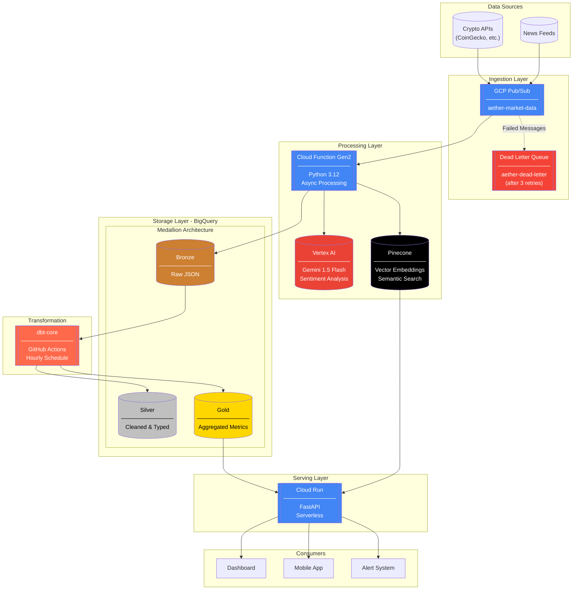

# Aether

**Serverless Data Lakehouse on GCP with AI-Powered Market Intelligence**

A production-grade, event-driven data pipeline that ingests cryptocurrency market data, enriches it with AI sentiment analysis, stores vector embeddings for semantic search, and serves insights through a scalable API.

## Architecture



## Why This Stack?

### Why Pulumi over Terraform?

| Aspect | Pulumi | Terraform |
|--------|--------|-----------|
| **Language** | Native Python/TypeScript | HCL (domain-specific) |
| **Testing** | pytest, unittest built-in | Requires terratest |
| **IDE Support** | Full autocomplete & type checking | Limited |
| **Reusability** | Classes, functions, inheritance | Modules only |
| **State** | Pulumi Cloud or self-managed | S3/GCS backend required |

```python
# Pulumi: Native Python with full IDE support
for i, role in enumerate(sa_roles):
    projects.IAMMember(f"sa-role-{i}", role=role, member=sa.email)
```

### Why Event-Driven over Cron?

- **Cron (Pull)**: Fixed intervals, wasted resources, delayed processing
- **Pub/Sub (Push)**: Real-time, scales to zero, pay-per-message

### Why Medallion Architecture?

```
Bronze (Raw) → Silver (Clean) → Gold (Analytics)
     ↓              ↓               ↓
  Audit Trail   Type Safety    Fast Queries
```

## Project Structure

```
Aether/
├── infra/                          # Pulumi Infrastructure
│   ├── __main__.py                 # GCP resources (Pub/Sub, BigQuery, IAM)
│   ├── Pulumi.yaml                 # Project configuration
│   └── requirements.txt
│
├── functions/                      # Cloud Functions
│   └── market_processor/
│       ├── main.py                 # Pub/Sub trigger → Vertex AI → BigQuery
│       └── requirements.txt
│
├── dbt/                            # Data Transformations
│   ├── dbt_project.yml
│   ├── profiles.yml
│   ├── packages.yml
│   ├── models/
│   │   ├── schema.yml              # Tests & documentation
│   │   ├── staging/
│   │   │   └── stg_market_data.sql
│   │   └── gold/
│   │       ├── gold_hourly_sentiment.sql
│   │       └── gold_latest_sentiment.sql
│   └── tests/
│       └── assert_sentiment_score_valid_range.sql
│
├── api/                            # FastAPI Service
│   ├── main.py                     # REST API endpoints
│   ├── requirements.txt
│   └── Dockerfile
│
└── .github/workflows/
    ├── deploy.yml                  # CI/CD pipeline
    └── dbt-run.yml                 # Hourly dbt transformations
```

## Features

### Dead Letter Queue (DLQ)

Messages that fail processing 3 times are automatically routed to `aether-dead-letter` for debugging and reprocessing:

```python
dead_letter_policy=pubsub.SubscriptionDeadLetterPolicyArgs(
    dead_letter_topic=dead_letter_topic.id,
    max_delivery_attempts=3,
)
```

### AI Sentiment Analysis

Each market data point is enriched with Vertex AI Gemini:

```python
# Returns score 1-10 with reasoning
{
    "score": 7.5,
    "reasoning": "Strong institutional buying pressure with ETF inflows..."
}
```

### Vector Semantic Search (Pinecone)

Search news by meaning, not just keywords:

```bash
# Query: "ethereum scaling solutions"
# Returns: Articles about L2s, rollups, sharding - even without exact match
```

### dbt Data Quality Tests

```yaml
# Enforced on every run
- sentiment_score between 1 and 10
- timestamp is never null
- unique record IDs
```

## Quick Start

### Prerequisites

- Python 3.12+
- [Pulumi CLI](https://www.pulumi.com/docs/install/)
- [gcloud CLI](https://cloud.google.com/sdk/docs/install)
- GCP Project with billing enabled

### 1. Clone & Setup

```bash
git clone https://github.com/yourusername/aether.git
cd aether

# Authenticate with GCP
gcloud auth login
gcloud config set project YOUR_PROJECT_ID
```

### 2. Deploy Infrastructure

```bash
cd infra
python -m venv venv
source venv/bin/activate  # or `venv\Scripts\activate` on Windows
pip install -r requirements.txt

# Set your project
pulumi config set gcp:project YOUR_PROJECT_ID

# Deploy
pulumi up
```

### 3. Deploy Cloud Function

```bash
gcloud functions deploy aether-market-processor \
  --gen2 \
  --runtime=python312 \
  --region=us-central1 \
  --source=functions/market_processor \
  --entry-point=process_market_data \
  --trigger-topic=aether-market-data \
  --memory=512MB \
  --timeout=300s
```

### 4. Deploy API

```bash
cd api
gcloud run deploy aether-api \
  --source=. \
  --region=us-central1 \
  --allow-unauthenticated
```

### 5. Setup dbt

```bash
cd dbt
pip install dbt-core dbt-bigquery
dbt deps
dbt run
dbt test
```

## API Endpoints

| Endpoint | Method | Description |
|----------|--------|-------------|
| `/health` | GET | Health check |
| `/api/v1/sentiment` | GET | All symbols sentiment summary |
| `/api/v1/sentiment/{symbol}` | GET | Single symbol sentiment |
| `/api/v1/sentiment/{symbol}/history` | GET | Hourly historical data |
| `/api/v1/search` | POST | Semantic search via Pinecone |

### Example Response

```json
{
  "symbol": "BTC",
  "sentiment_score": 7.8,
  "sentiment_category": "BULLISH",
  "sentiment_trend": "IMPROVING",
  "price_usd": 67500.00,
  "percent_change_24h": 2.5,
  "ai_reasoning": "Strong institutional accumulation with record ETF inflows...",
  "last_updated": "2026-05-02T10:00:00Z"
}
```

## Environment Variables

| Variable | Description | Required |
|----------|-------------|----------|
| `GCP_PROJECT_ID` | GCP Project ID | Yes |
| `GCP_LOCATION` | Region (default: us-central1) | No |
| `BIGQUERY_DATASET` | Dataset name (default: aether_lakehouse) | No |
| `PINECONE_API_KEY` | Pinecone API key | Yes |
| `PINECONE_INDEX` | Pinecone index name | Yes |

## Cost Optimization

This project is designed to run within GCP's free tier:

| Service | Free Tier | Our Usage |
|---------|-----------|-----------|
| Pub/Sub | 10GB/month | ~1GB |
| Cloud Functions | 2M invocations | ~10K |
| BigQuery | 1TB queries, 10GB storage | ~5GB |
| Cloud Run | 2M requests | ~50K |
| Vertex AI | $300 credit | Minimal |

## Testing

```bash
# Run dbt tests
cd dbt && dbt test

# Test API locally
cd api && uvicorn main:app --reload

# Test Cloud Function locally
cd functions/market_processor
functions-framework --target=process_market_data --debug
```

## Contributing

1. Fork the repository
2. Create a feature branch (`git checkout -b feature/amazing-feature`)
3. Commit changes (`git commit -m 'Add amazing feature'`)
4. Push to branch (`git push origin feature/amazing-feature`)
5. Open a Pull Request

## License

MIT License - see [LICENSE](LICENSE) for details.

---

Built with Pulumi, dbt, Vertex AI, Pinecone, and FastAPI on Google Cloud Platform.
